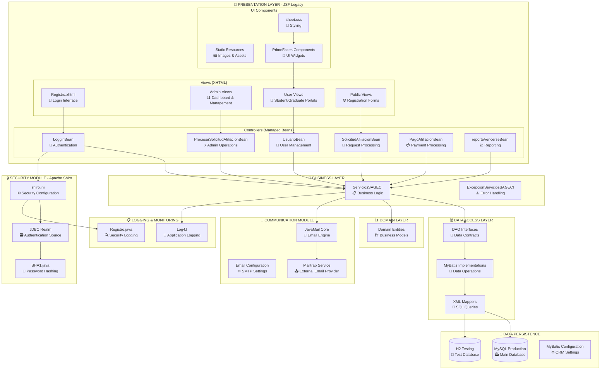

# Diagramas de Arquitectura - SGAECI

## 1. Diagrama de Componentes Detallado del Sistema Legacy

## 2. Componentes Priorizados para Modernización

### 🎯 **COMPONENTES CRÍTICOS A MODERNIZAR**

```mermaid
flowchart TD
    %% Alta Prioridad - Core del Negocio
    subgraph CRITICAL [" "]
        direction TB
        CRITICAL_TITLE["🔴 ALTA PRIORIDAD - Core del Negocio"]
        
        %% F001 - Autenticación
        AUTH_TITLE["F001 - Sistema de Autenticación"]
        AUTH_LEGACY["LogginBean + Shiro<br/>❌ JSF Managed Bean<br/>❌ SHA-1 Obsoleto<br/>❌ UI Legacy"]
        AUTH_MODERN["🔄 Modernizar a:<br/>✅ JWT/OAuth 2.0<br/>✅ React/Vue Components<br/>✅ Bcrypt/Argon2"]
        
        %% F002 - Formularios
        FORMS_TITLE["F002 - Formularios de Solicitud"]
        FORMS_LEGACY["SolicitudAfiliacionBean<br/>❌ Wizard JSF Complejo<br/>❌ Validaciones Limitadas<br/>❌ UX Desactualizada"]
        FORMS_MODERN["🔄 Modernizar a:<br/>✅ Multi-step Modern Forms<br/>✅ Real-time Validation<br/>✅ Responsive Design"]
        
        %% F003 - Dashboard
        ADMIN_TITLE["F003 - Dashboard Administrativo"]
        ADMIN_LEGACY["ProcesarSolicitudAfiliacionBean<br/>❌ Tablas JSF Básicas<br/>❌ Filtrado Limitado<br/>❌ UX Administrativa Pobre"]
        ADMIN_MODERN["🔄 Modernizar a:<br/>✅ Filtros Inteligentes<br/>✅ Dashboard Moderno"]
        
        %% F004 - Certificados
        CERT_TITLE["F004 - Generación de Certificados"]
        CERT_LEGACY["UsuarioBean + iText<br/>❌ PDF Básico<br/>❌ Diseño Desactualizado<br/>❌ Sin Personalización"]
        CERT_MODERN["🔄 Modernizar a:<br/>✅ Templates Modernos<br/>✅ Diseño Profesional<br/>"]
    end
    
    %% Media Prioridad
    subgraph MEDIUM [" "]
        direction TB
        MEDIUM_TITLE["🟡 MEDIA PRIORIDAD - Mejoras Operacionales"]
        
        %% F005 - Verificación Pagos
        PAY_TITLE["F005 - Verificación de Pagos"]
        PAY_LEGACY["ProcesarPagosAfiliacionBean<br/>❌ Visor Básico<br/>❌ Sin Herramientas"]
        PAY_MODERN["🔄 Mejorar:<br/>✅ Visor Avanzado<br/>✅ Herramientas de documentos"]
        
        %% F006 - Carga Comprobantes
        UPLOAD_TITLE["F006 - Carga de Comprobantes"]
        UPLOAD_LEGACY["GenerarPago Bean<br/>❌ Upload Básico<br/>❌ Sin Preview"]
        UPLOAD_MODERN["🔄 Mejorar:<br/>✅ Progreso de subida<br/>✅ Preview Integrado"]
    end
    
    %% Infraestructura y Soporte - También se moderniza
    subgraph INFRA [" "]
        direction TB
        INFRA_TITLE["� INFRAESTRUCTURA - Migración Completa"]
        
        %% F007 - Sistema de Reportes
        REPORT_TITLE["F007 - Sistema de Reportes"]
        REPORT_LEGACY["reporteVencerseBean + iText<br/>❌ Reportes Básicos<br/>❌ Sin Dashboard<br/>"]
        REPORT_MODERN["� Modernizar a:<br/>✅ Microservicio de reportes<br/>✅ Dashboard Interactivo<br/>"]
        
        %% F008 - Sistema de Email
        EMAIL_TITLE["F008 - Sistema de Email"]
        EMAIL_LEGACY["JavaMail + Mailtrap<br/>❌ Configuración Manual<br/>❌ Sin Métricas<br/>❌ Templates Básicos"]
        EMAIL_MODERN["� Modernizar a:<br/>✅ Microservicio de Notificaciones<br/>✅ Templates Dinámicos<br/>✅ Métricas Avanzadas"]
        
        %% F009 - Capa de Datos
        DATA_TITLE["F009 - Capa de Acceso a Datos"]
        DATA_LEGACY["MyBatis + MySQL<br/>❌ ORM Legacy<br/>❌ Escalabilidad Limitada"]
        DATA_MODERN["� Modernizar a:<br/>✅ SQLAlchemy + PostgreSQL<br/>✅ Auto-scaling"]
        
        %% F010 - Seguridad Core
        SECURITY_TITLE["F010 - Infraestructura de Seguridad"]
        SECURITY_LEGACY["Apache Shiro + SHA-1<br/>❌ Framework Legacy<br/>❌ Hash Inseguro<br/>"]
        SECURITY_MODERN["🔄 Modernizar a:<br/>✅ JWT/OAuth 2.0<br/>"]
    end
    
    %% Conexiones y layout
    CRITICAL_TITLE --- AUTH_TITLE
    AUTH_TITLE --- AUTH_LEGACY
    AUTH_LEGACY -.-> AUTH_MODERN
    
    AUTH_MODERN --- FORMS_TITLE
    FORMS_TITLE --- FORMS_LEGACY
    FORMS_LEGACY -.-> FORMS_MODERN
    
    FORMS_MODERN --- ADMIN_TITLE
    ADMIN_TITLE --- ADMIN_LEGACY
    ADMIN_LEGACY -.-> ADMIN_MODERN
    
    ADMIN_MODERN --- CERT_TITLE
    CERT_TITLE --- CERT_LEGACY
    CERT_LEGACY -.-> CERT_MODERN
    
    MEDIUM_TITLE --- PAY_TITLE
    PAY_TITLE --- PAY_LEGACY
    PAY_LEGACY -.-> PAY_MODERN
    
    PAY_MODERN --- UPLOAD_TITLE
    UPLOAD_TITLE --- UPLOAD_LEGACY
    UPLOAD_LEGACY -.-> UPLOAD_MODERN
    
    INFRA_TITLE --- REPORT_TITLE
    REPORT_TITLE --- REPORT_LEGACY
    REPORT_LEGACY -.-> REPORT_MODERN
    
    REPORT_MODERN --- EMAIL_TITLE
    EMAIL_TITLE --- EMAIL_LEGACY
    EMAIL_LEGACY -.-> EMAIL_MODERN
    
    EMAIL_MODERN --- DATA_TITLE
    DATA_TITLE --- DATA_LEGACY
    DATA_LEGACY -.-> DATA_MODERN
    
    DATA_MODERN --- SECURITY_TITLE
    SECURITY_TITLE --- SECURITY_LEGACY
    SECURITY_LEGACY -.-> SECURITY_MODERN
    
    %% Espaciado entre secciones
    CERT_MODERN ~~~ MEDIUM_TITLE
    UPLOAD_MODERN ~~~ INFRA_TITLE
    
    %% Estilos
    classDef criticalBox fill:#ffebee,stroke:#d32f2f,stroke-width:2px
    classDef mediumBox fill:#fff3e0,stroke:#f57c00,stroke-width:2px
    classDef infraBox fill:#e3f2fd,stroke:#1976d2,stroke-width:2px
    classDef legacy fill:#ffcdd2,stroke:#c62828,stroke-width:2px
    classDef modern fill:#c8e6c9,stroke:#2e7d32,stroke-width:2px
    classDef title fill:#e3f2fd,stroke:#1976d2,stroke-width:2px,font-weight:bold
    
    class CRITICAL_TITLE,MEDIUM_TITLE,INFRA_TITLE title
    class AUTH_TITLE,FORMS_TITLE,ADMIN_TITLE,CERT_TITLE,PAY_TITLE,UPLOAD_TITLE title
    class REPORT_TITLE,EMAIL_TITLE,DATA_TITLE,SECURITY_TITLE title
    class AUTH_LEGACY,FORMS_LEGACY,ADMIN_LEGACY,CERT_LEGACY,PAY_LEGACY,UPLOAD_LEGACY legacy
    class REPORT_LEGACY,EMAIL_LEGACY,DATA_LEGACY,SECURITY_LEGACY legacy
    class AUTH_MODERN,FORMS_MODERN,ADMIN_MODERN,CERT_MODERN,PAY_MODERN,UPLOAD_MODERN modern
    class REPORT_MODERN,EMAIL_MODERN,DATA_MODERN,SECURITY_MODERN modern
```

### 📋 **JUSTIFICACIÓN DE MODERNIZACIÓN POR COMPONENTE**

#### 🔴 **COMPONENTES CRÍTICOS (F001-F004)**

| **COMPONENTE** | **ESTADO ACTUAL** | **PROBLEMAS IDENTIFICADOS** | **JUSTIFICACIÓN DE MODERNIZACIÓN** |
|----------------|-------------------|------------------------------|-------------------------------------|
| **🔑 Sistema de Autenticación** | LogginBean + Apache Shiro + SHA-1 | - JSF Managed Bean obsoleto - SHA-1 deprecated (inseguro) - UX de login desactualizada - Sin recuperación de contraseña | **CRÍTICO:** Es la puerta de entrada al sistema. La seguridad obsoleta compromete toda la plataforma. La UX pobre impacta la primera impresión de AECI. |
| **📝 Formularios de Solicitud** | SolicitudAfiliacionBean + Wizard JSF | - Wizard JSF complejo y confuso - Validaciones limitadas - UI no responsiva - Baja conversión de solicitudes | **CRÍTICO:** Proceso core para captar nuevos afiliados. La complejidad actual reduce conversiones y afecta el crecimiento de AECI. Primera impresión negativa de la asociación. |
| **📊 Dashboard Administrativo** | ProcesarSolicitudAfiliacionBean | - Tablas JSF básicas - Sin filtros avanzados - Gestión ineficiente - Tiempo excesivo por proceso | **CRÍTICO:** Los administradores son el cuello de botella. La ineficiencia actual impacta directamente los tiempos de respuesta a solicitantes y la operación diaria. |
| **📄 Generación de Certificados** | UsuarioBean + iText PDF | - Diseño desactualizado - PDF básico sin personalización - Imagen institucional pobre - Sin opciones de formato | **CRÍTICO:** Es el producto principal que AECI entrega. Un certificado desactualizado no refleja el profesionalismo de la institución y afecta la percepción de valor. |

#### 🟡 **COMPONENTES OPCIONALES (F005-F006)**

| **COMPONENTE** | **ESTADO ACTUAL** | **MEJORAS PROPUESTAS** | **JUSTIFICACIÓN** |
|----------------|-------------------|------------------------|-------------------|
| **💳 Verificación de Pagos** | ProcesarPagosAfiliacionBean | - Visor de imágenes mejorado - Herramientas de zoom/rotación - Procesamiento por lotes | **MEDIA:** Funcionalidad actual operativa. Mejoras incrementarían eficiencia administrativa. |
| **📤 Carga de Comprobantes** | GenerarPago Bean | - Drag & drop moderno - Preview antes de envío - Múltiples formatos - Validación automática | **MEDIA:** Solo afecta egresados. Mejoras de comodidad y UX. |

#### 🔵 **COMPONENTES DE INFRAESTRUCTURA (F007-F010)**

| **COMPONENTE** | **ESTADO ACTUAL** | **MODERNIZACIÓN REQUERIDA** | **JUSTIFICACIÓN** |
|----------------|-------------------|------------------------------|-------------------|
| **📊 Sistema de Reportes** | reporteVencerseBean + iText | **Microservicio de Analytics + Dashboard Interactivo** | **NECESARIO:** Migración completa requiere modernizar toda la infraestructura de reportes para arquitectura cloud |
| **📧 Sistema de Email** | JavaMail + Mailtrap | **Microservicio de Notificaciones + Templates Dinámicos** | **NECESARIO:** Migración a microservicios requiere servicio independiente con mejor escalabilidad |
| **🗄️ Capa de Acceso a Datos** | MyBatis + MySQL | **SQLAlchemy + PostgreSQL + Redis Cache** | **NECESARIO:** Cambio de stack tecnológico completo, incluyendo base de datos |
| **🔒 Infraestructura de Seguridad** | Apache Shiro + SHA-1 | **JWT/OAuth 2.0 + Bcrypt/Argon2 + Auditoría** | **NECESARIO:** Migración completa a Python requiere nueva infraestructura de seguridad |

### 🎯 **CRITERIOS DE PRIORIZACIÓN BASADOS EN FEATURES.MD**

#### **Impacto en Core del Negocio:**
1. **F001 (Autenticación):** Base de seguridad - sin esto, nada funciona
2. **F002 (Solicitudes):** Crecimiento de membresía - captación de nuevos afiliados
3. **F003 (Aprobación):** Eficiencia operativa - cuello de botella administrativo
4. **F004 (Certificados):** Producto principal - imagen institucional

#### **Problemas Técnicos Críticos:**
- **JSF Legacy:** Tecnología obsoleta, difícil mantenimiento
- **Seguridad Desactualizada:** SHA-1 deprecated, vulnerabilidades
- **UX Pobre:** Interfaces no intuitivas, baja adopción
- **Performance:** Tecnologías lentas, no escalables

### 🚀 **MIGRACIÓN COMPLETA - Todos los Componentes Requieren Modernización**

> **NOTA IMPORTANTE:** Dado que se realizará una **migración completa** a arquitectura moderna con **Python + Microservicios + PostgreSQL + Cloud**, NO existen componentes que se mantengan sin cambios. Todo el stack tecnológico legacy será reemplazado.