# Estructura de Carpetas del Proyecto SGAECI (Backend)

## Estructura Completa del Proyecto

```
SGAECI-2-legacy/
├── 📁 Root Files
│   ├── pom.xml                          # Configuración Maven con dependencias y plugins
│   ├── nb-configuration.xml             # Configuración de NetBeans IDE
│   ├── system.properties                # Propiedades del sistema para Heroku
│   ├── Procfile                         # Archivo de despliegue para Heroku
│   ├── circle.yml                       # Configuración de CircleCI para CI/CD
│   ├── README.md                        # Documentación del proyecto
│   ├── tables.sql                       # Script DDL para creación de tablas de BD
│   ├── triggers.sql                     # Script de triggers de base de datos
│   ├── DocumentoFinal.docx/.pdf         # Documentación técnica del proyecto
│   └── architecture.md                  # Análisis de arquitectura del sistema
│
├── 📁 src/main/java/edu/eci/pdsw/samples/
│   │
│   ├── 📁 managedbeans/ (CAPA DE PRESENTACIÓN - Controllers JSF)
│   │   ├── BienvenidaBean.java          # Controller: Página principal y formulario de contacto
│   │   ├── LogginBean.java              # Controller: Autenticación y gestión de sesiones
│   │   ├── UsuarioBean.java             # Controller: Gestión de perfil usuario y generación PDFs
│   │   ├── SolicitudAfiliacionBean.java # Controller: Formularios de solicitud de afiliación
│   │   ├── ProcesarSolicitudAfiliacionBean.java # Controller: Admin - Aprobación/rechazo solicitudes
│   │   ├── PagoAfiliacionBean.java      # Controller: Envío de comprobantes de pago
│   │   ├── ProcesarPagosAfiliacionBean.java # Controller: Admin - Procesamiento de pagos
│   │   └── reporteVencerseBean.java     # Controller: Reportes de afiliaciones por vencer
│   │
│   ├── 📁 services/ (CAPA DE NEGOCIO - Business Logic)
│   │   ├── ServiciosSAGECI.java         # Interface: Definición de servicios de negocio
│   │   ├── ServiciosSAGECIDAOS.java     # Implementation: Lógica de negocio principal
│   │   └── ExcepcionServiciosSAGECI.java # Exception: Excepciones personalizadas del negocio
│   │
│   ├── 📁 entities/ (CAPA DE DOMINIO - Domain Models)
│   │   ├── Persona.java                 # Entity: Clase base para usuarios del sistema
│   │   ├── Estudiante.java              # Entity: Entidad estudiante (hereda de Persona)
│   │   ├── Egresado.java                # Entity: Entidad egresado (hereda de Persona)
│   │   ├── Egresado_Empresa.java        # Entity: Información laboral de egresados
│   │   ├── SolicitudAfiliacion.java     # Entity: Solicitudes de afiliación
│   │   ├── PagoAfiliacion.java          # Entity: Pagos y comprobantes
│   │   ├── estadoAfiliacion.java        # Entity: Estado de afiliación del usuario
│   │   ├── Rol.java                     # Entity: Roles del sistema (Admin, Egresado, Estudiante)
│   │   └── imagen.java                  # Entity: Manejo de imágenes para galería
│   │
│   ├── 📁 persistence/ (CAPA DE ACCESO A DATOS - Repository Layer)
│   │   ├── 📁 interfaces/ (DAO Interfaces)
│   │   │   ├── DaoFactory.java          # Factory: Patrón Factory para creación de DAOs
│   │   │   ├── DaoPersona.java          # Interface: DAO para entidad Persona
│   │   │   ├── DaoEstudiante.java       # Interface: DAO para entidad Estudiante
│   │   │   ├── DaoEgresado.java         # Interface: DAO para entidad Egresado
│   │   │   ├── DaoEgresadoEmpresa.java  # Interface: DAO para entidad Egresado_Empresa
│   │   │   ├── DaoSolicitudAfiliacion.java # Interface: DAO para SolicitudAfiliacion
│   │   │   ├── DaoPagoAfiliacion.java   # Interface: DAO para PagoAfiliacion
│   │   │   ├── DaoEstadoAfiliacion.java # Interface: DAO para estadoAfiliacion
│   │   │   ├── DaoRolPersona.java       # Interface: DAO para relación Rol-Persona
│   │   │   └── PersistenceException.java # Exception: Excepciones de persistencia
│   │   │
│   │   └── 📁 mybatisimpl/ (MyBatis Implementations)
│   │       ├── MyBatisDaoFactory.java   # Implementation: Factory de DAOs para MyBatis
│   │       ├── MyBatisDAOPersona.java   # Implementation: DAO MyBatis para Persona
│   │       ├── MyBatisDAOEstudiante.java # Implementation: DAO MyBatis para Estudiante
│   │       ├── MyBatisDAOEgresado.java  # Implementation: DAO MyBatis para Egresado
│   │       ├── MyBatisDAOEgresadoEmpresa.java # Implementation: DAO MyBatis para Egresado_Empresa
│   │       ├── MyBatisDAOSolicitudAfiliacion.java # Implementation: DAO MyBatis para SolicitudAfiliacion
│   │       ├── MyBatisDAOPagoAfiliacion.java # Implementation: DAO MyBatis para PagoAfiliacion
│   │       ├── MyBatisDAOEstadoAfiliacion.java # Implementation: DAO MyBatis para estadoAfiliacion
│   │       ├── MyBatisDAORolPersona.java # Implementation: DAO MyBatis para RolPersona
│   │       │
│   │       └── 📁 mappers/ (MyBatis Mapper Interfaces)
│   │           ├── PersonaMapper.java   # Mapper: SQL operations para Persona
│   │           ├── EstudianteMapper.java # Mapper: SQL operations para Estudiante
│   │           ├── EgresadoMapper.java  # Mapper: SQL operations para Egresado
│   │           ├── EmpresaMapper.java   # Mapper: SQL operations para Empresa
│   │           ├── SolicitudAfMapper.java # Mapper: SQL operations para SolicitudAfiliacion
│   │           ├── PagoAfMapper.java    # Mapper: SQL operations para PagoAfiliacion
│   │           ├── EstadoAfMapper.java  # Mapper: SQL operations para estadoAfiliacion
│   │           └── RolPersonaMapper.java # Mapper: SQL operations para RolPersona
│   │
│   ├── 📁 Security/ (SEGURIDAD Y AUTENTICACIÓN)
│   │   ├── SHA1.java                    # Utility: Hashing de contraseñas con SHA-1
│   │   └── Registro.java                # Utility: Logging y registro de eventos de seguridad
│   │
│   └── 📁 javamail/ (COMUNICACIONES - Email Module)
│       ├── 📁 core/
│       │   ├── Email.java               # Interface: Definición de email
│       │   ├── SimpleEmail.java         # Implementation: Email simple de texto
│       │   ├── EmailSender.java         # Interface: Definición de envío de emails
│       │   ├── SimpleEmailSender.java   # Implementation: Enviador de emails simple
│       │   ├── AbstractEmailSender.java # Abstract: Clase base para enviadores
│       │   └── EmailConfiguration.java  # Config: Configuración de servidor de email
│       │
│       └── 📁 client/standalone/
│           └── SendEmail.java           # Utility: Cliente standalone para envío de emails
│
├── 📁 src/main/resources/ (CONFIGURACIONES Y RECURSOS)
│   ├── 📁 Database Configuration
│   │   ├── mybatis-config.xml           # Config: Configuración principal de MyBatis (MySQL)
│   │   ├── h2-mybatis-config.xml        # Config: Configuración MyBatis para H2 (testing)
│   │   ├── applicationconfig.properties # Config: Configuración de aplicación (producción)
│   │   ├── applicationconfig _test.properties # Config: Configuración para testing
│   │   └── h2-applicationconfig.properties # Config: Configuración H2 para testing
│   │
│   ├── 📁 Security Configuration
│   │   └── shiro.ini                    # Config: Configuración de Apache Shiro (seguridad)
│   │
│   ├── 📁 Logging Configuration
│   │   └── log4j.properties             # Config: Configuración de logging con Log4J
│   │
│   ├── 📁 Email Configuration
│   │   └── javamail.properties          # Config: Configuración de JavaMail
│   │
│   └── 📁 mappers/ (SQL MAPPERS - MyBatis XML)
│       ├── PersonaMapper.xml            # SQL: Queries para operaciones de Persona
│       ├── EstudianteMapper.xml         # SQL: Queries para operaciones de Estudiante
│       ├── EgresadoMapper.xml           # SQL: Queries para operaciones de Egresado
│       ├── EmpresaMapper.xml            # SQL: Queries para operaciones de Empresa
│       ├── SolicitudAfMapper.xml        # SQL: Queries para operaciones de SolicitudAfiliacion
│       ├── PagoAfMapper.xml             # SQL: Queries para operaciones de PagoAfiliacion
│       ├── EstadoAfMapper.xml           # SQL: Queries para operaciones de estadoAfiliacion
│       └── RolPersonaMapper.xml         # SQL: Queries para operaciones de RolPersona
│
├── 📁 src/main/webapp/ (FRONTEND - Web Layer)
│   ├── 📁 Root Pages
│   │   ├── index.xhtml                  # View: Página raíz con enlaces principales
│   │   ├── Bienvenida.xhtml             # View: Página de bienvenida e información
│   │   ├── Registro.xhtml               # View: Formulario de login/autenticación
│   │   ├── unauthorized.xhtml           # View: Página de acceso no autorizado
│   │   └── sheet.css                    # Styles: Hoja de estilos principal
│   │
│   ├── 📁 open/ (PÁGINAS PÚBLICAS)
│   │   ├── SolicitudAfiliacionEst.xhtml # View: Formulario solicitud para estudiantes
│   │   └── SolicitudAfiliacionEgre.xhtml # View: Formulario solicitud para egresados
│   │
│   ├── 📁 Admin/ (ÁREA ADMINISTRATIVA)
│   │   ├── index.xhtml                  # View: Dashboard principal de administrador
│   │   ├── Opciones.xhtml               # View: Panel de opciones de administrador
│   │   ├── ProcesarSolicitudesAfiliacion.xhtml # View: Gestión de solicitudes pendientes
│   │   ├── ProcesarPagosAfiliacion.xhtml # View: Gestión de pagos pendientes
│   │   └── SolicitudesPorVencer.xhtml   # View: Reporte de afiliaciones por vencer
│   │
│   ├── 📁 Egresado/ (ÁREA DE EGRESADOS)
│   │   ├── index.xhtml                  # View: Dashboard de egresado
│   │   └── Opciones.xhtml               # View: Gestión de perfil y opciones de egresado
│   │
│   ├── 📁 Estudiante/ (ÁREA DE ESTUDIANTES)
│   │   ├── index.xhtml                  # View: Dashboard de estudiante
│   │   └── Opciones.xhtml               # View: Gestión de perfil y opciones de estudiante
│   │
│   ├── 📁 resource/ (RECURSOS ESTÁTICOS)
│   │   ├── AECI.PNG                     # Image: Logo principal de AECI
│   │   ├── aecimagen.png                # Image: Imagen institucional
│   │   ├── acceso-denegado.jpg          # Image: Imagen para acceso denegado
│   │   └── [otras imágenes]             # Images: Galería de empresas y recursos
│   │
│   ├── 📁 WEB-INF/ (CONFIGURACIÓN WEB)
│   │   ├── web.xml                      # Config: Configuración principal de la aplicación web
│   │   └── META-INF/
│   │       └── context.xml              # Config: Contexto de la aplicación
│   │
│   └── 📁 META-INF/
│       └── context.xml                  # Config: Configuración de contexto adicional
│
├── 📁 src/test/java/edu/eci/pdsw/samples/tests/ (TESTING)
│   ├── ReportePorVencerTest.java        # Test: Pruebas unitarias para reporte de vencimientos
│   └── PersonasPagoRealizarTest.java    # Test: Pruebas unitarias para gestión de pagos
│
├── 📁 target/ (DIRECTORIO DE COMPILACIÓN)
│   ├── PDSW.war                         # Artifact: Archivo WAR desplegable
│   ├── 📁 classes/                      # Compiled: Clases Java compiladas y recursos
│   ├── 📁 dependency/
│   │   └── webapp-runner.jar            # Dependency: Servidor embebido para Heroku
│   ├── 📁 db/                           # Database: Base de datos H2 para testing
│   │   ├── testdb2.mv.db                # DB File: Archivo de base de datos H2
│   │   └── testdb2.trace.db             # DB File: Archivo de traza H2
│   └── 📁 [otros directorios de build] # Build: Otros artefactos de construcción
│
└── 📁 nbproject/ (IDE CONFIGURATION)
    └── project.properties                # IDE: Configuración específica de NetBeans
```

## Resumen de Arquitectura por Capas

### 🎯 Capa de Presentación (Frontend)
**Responsabilidad:** Interfaz de usuario, validación de entrada, navegación
- **Tecnología:** JSF 2.2 + PrimeFaces 6.0 + XHTML
- **Archivos:** `src/main/webapp/` + `managedbeans/`
- **Patrón:** MVC con Managed Beans como Controllers

### 🏢 Capa de Negocio (Business Logic)
**Responsabilidad:** Reglas de negocio, workflows, validaciones complejas
- **Tecnología:** Java EE + Service Layer Pattern
- **Archivos:** `services/`
- **Patrón:** Service Layer con interfaces y implementaciones

### 🗄️ Capa de Acceso a Datos (Data Access)
**Responsabilidad:** Persistencia, transacciones, consultas SQL
- **Tecnología:** MyBatis 3.2.7 + MySQL/H2
- **Archivos:** `persistence/` + `mappers/`
- **Patrón:** DAO Pattern + Repository Pattern

### 🔐 Módulos Transversales
**Seguridad:** Apache Shiro + SHA-1 (`Security/`)
**Comunicaciones:** JavaMail API (`javamail/`)
**Configuración:** Properties + XML (`resources/`)
**Testing:** JUnit + H2 (`test/`)

---

# Diagramas de Arquitectura - SGAECI

## 1. Diagrama de Componentes

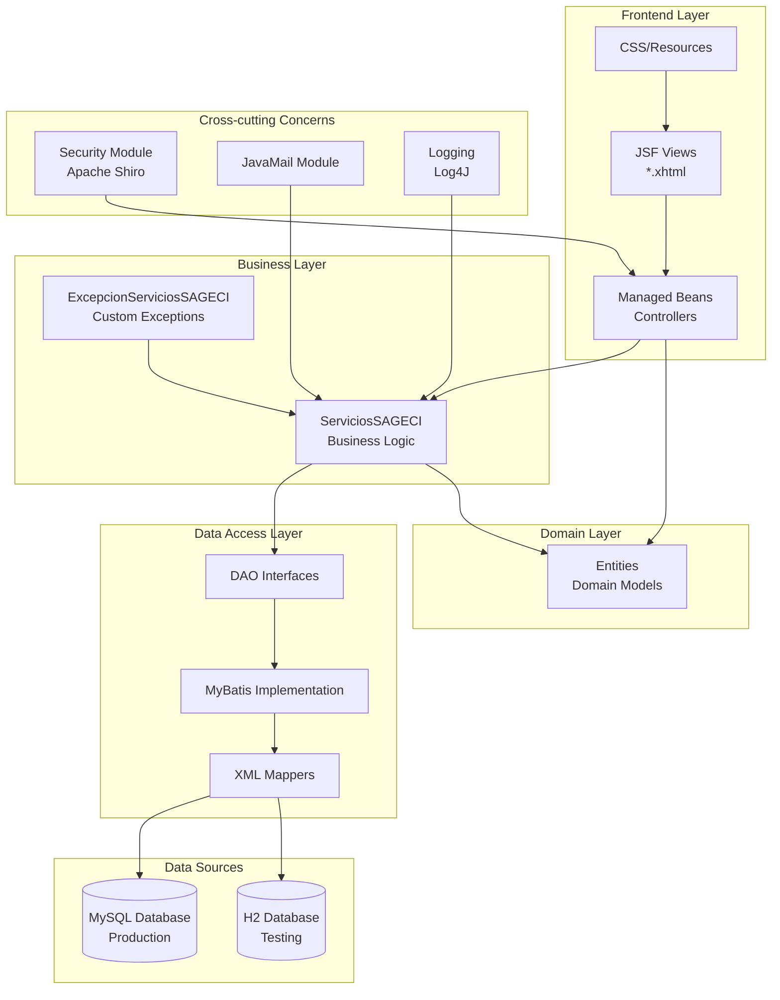

## 2. Diagrama de Despliegue

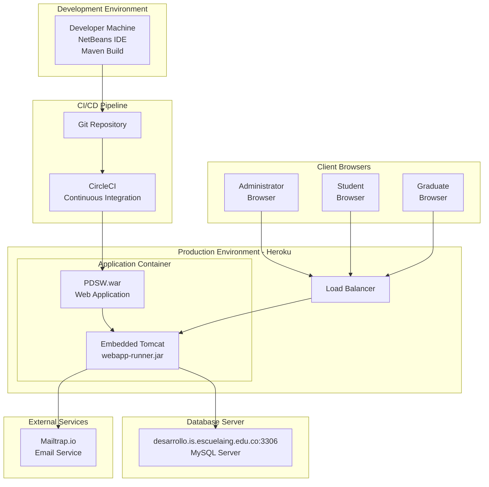

## 3. Diagrama de Flujo de Datos

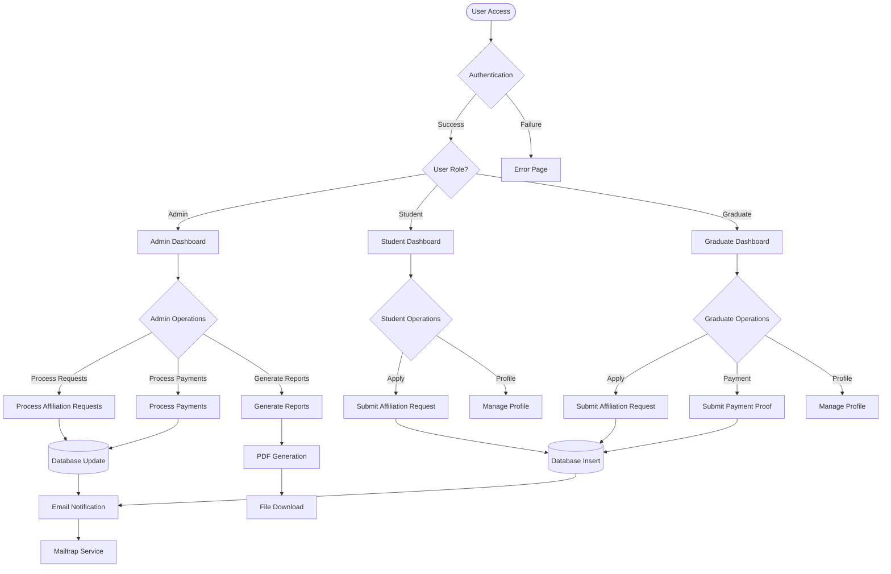

## 4. Diagrama de Clases Principal

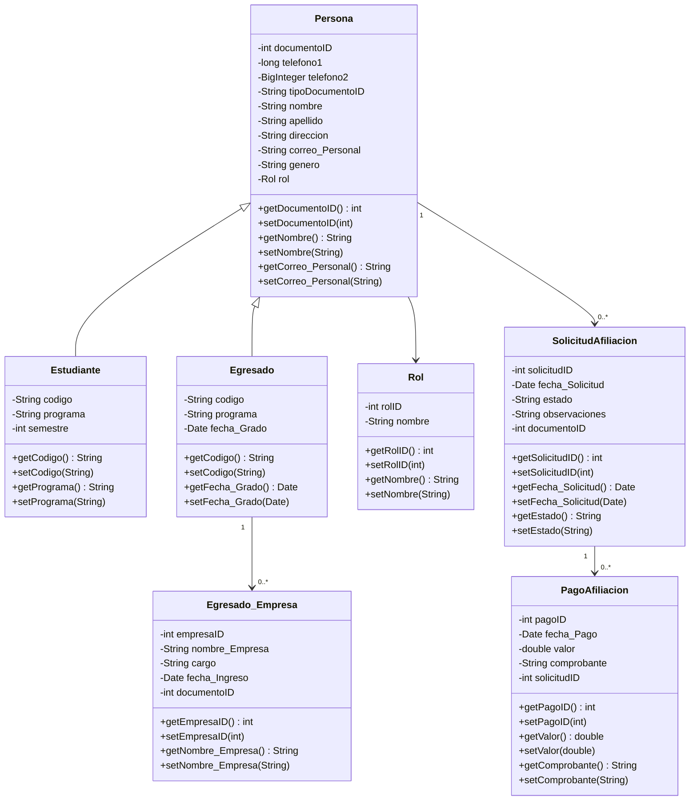

## 5. Diagrama de Paquetes

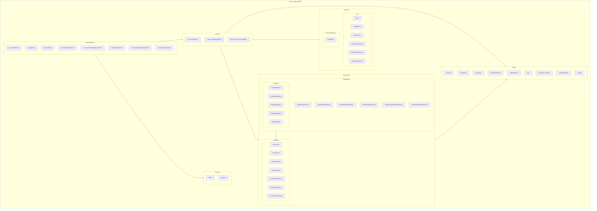

## 6. Diagramas de Clases por Carpeta

### 6.1. Managed Beans (Controllers)

```mermaid
classDiagram
    class BienvenidaBean {
        -String nombre
        -String email
        -String mensaje
        +enviarMensaje()
        +limpiarFormulario()
        +getNombre() String
        +setNombre(String)
        +getEmail() String
        +setEmail(String)
    }
    
    class LogginBean {
        -String usuario
        -String password
        -boolean loggedIn
        -String userRole
        +iniciarSesion() String
        +cerrarSesion() String
        +validarCredenciales() boolean
        +getUsuario() String
        +setUsuario(String)
        +isLoggedIn() boolean
    }
    
    class UsuarioBean {
        -Persona personaActual
        -List~Persona~ listaPersonas
        +actualizarPerfil() String
        +generarCertificadoPDF() void
        +cargarDatosUsuario() void
        +getPersonaActual() Persona
        +setPersonaActual(Persona)
    }
    
    class SolicitudAfiliacionBean {
        -SolicitudAfiliacion solicitud
        -List~SolicitudAfiliacion~ listaSolicitudes
        +enviarSolicitud() String
        +validarDatos() boolean
        +cargarSolicitudes() void
        +getSolicitud() SolicitudAfiliacion
        +setSolicitud(SolicitudAfiliacion)
    }
    
    class ProcesarSolicitudAfiliacionBean {
        -List~SolicitudAfiliacion~ solicitudesPendientes
        -SolicitudAfiliacion solicitudSeleccionada
        +aprobarSolicitud() String
        +rechazarSolicitud() String
        +cargarSolicitudesPendientes() void
        +enviarNotificacion() void
    }
    
    class PagoAfiliacionBean {
        -PagoAfiliacion pago
        -List~PagoAfiliacion~ listaPagos
        -String archivoComprobante
        +subirComprobante() String
        +validarPago() boolean
        +cargarPagos() void
        +getPago() PagoAfiliacion
        +setPago(PagoAfiliacion)
    }
    
    class ProcesarPagosAfiliacionBean {
        -List~PagoAfiliacion~ pagosPendientes
        -PagoAfiliacion pagoSeleccionado
        +aprobarPago() String
        +rechazarPago() String
        +cargarPagosPendientes() void
        +generarRecibo() void
    }
    
    class reporteVencerseBean {
        -List~SolicitudAfiliacion~ afiliacionesPorVencer
        -Date fechaLimite
        +generarReporte() void
        +exportarPDF() void
        +cargarAfiliacionesPorVencer() void
        +getFechaLimite() Date
        +setFechaLimite(Date)
    }
    
    UsuarioBean --> Persona
    SolicitudAfiliacionBean --> SolicitudAfiliacion
    ProcesarSolicitudAfiliacionBean --> SolicitudAfiliacion
    PagoAfiliacionBean --> PagoAfiliacion
    ProcesarPagosAfiliacionBean --> PagoAfiliacion
    reporteVencerseBean --> SolicitudAfiliacion
```

### 6.2. Services (Business Logic)

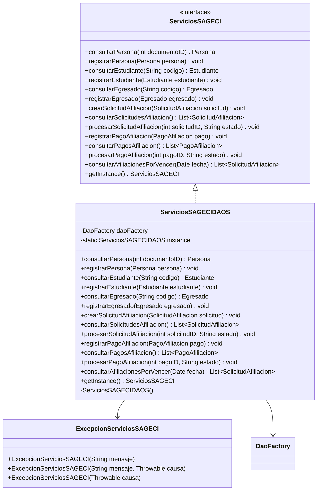

### 6.3. Entities (Domain Models)

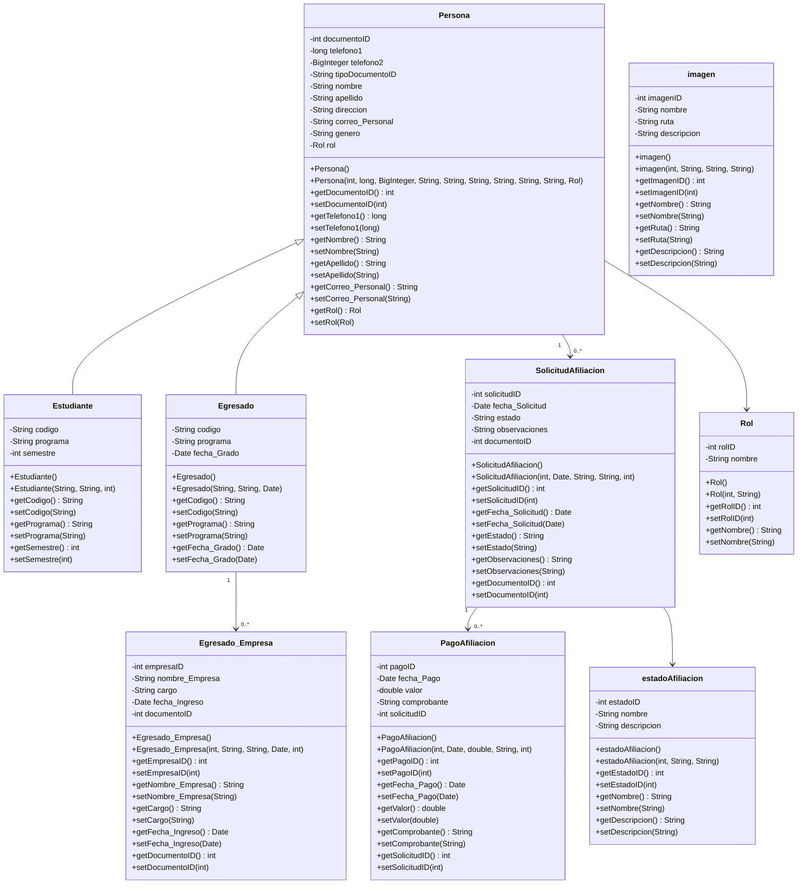

### 6.4. Persistence Layer (DAO & MyBatis)

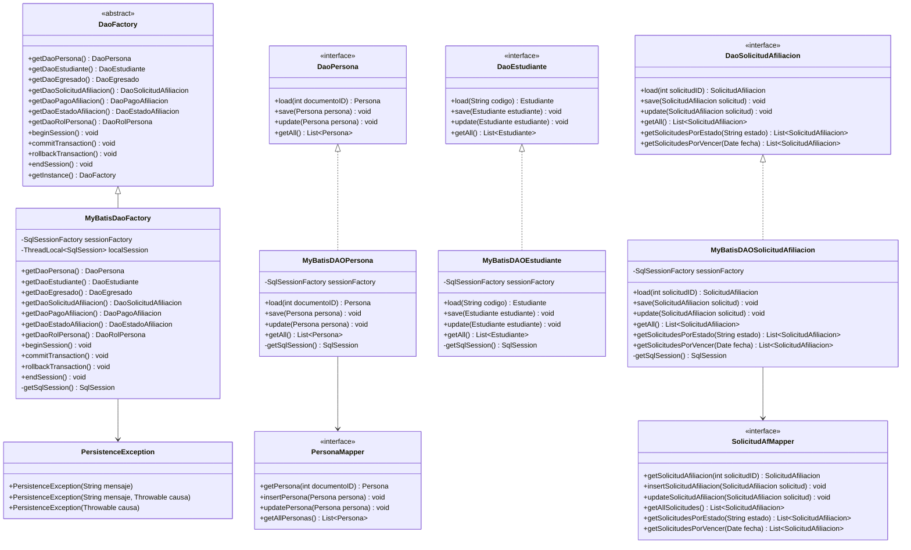

### 6.5. Security Module

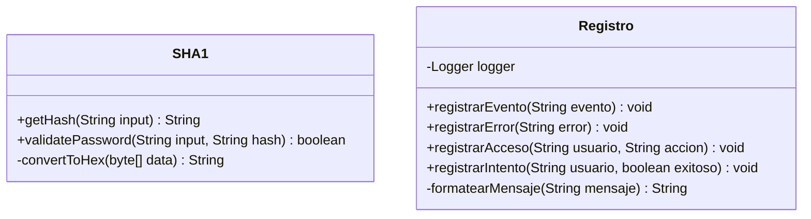

### 6.6. JavaMail Module

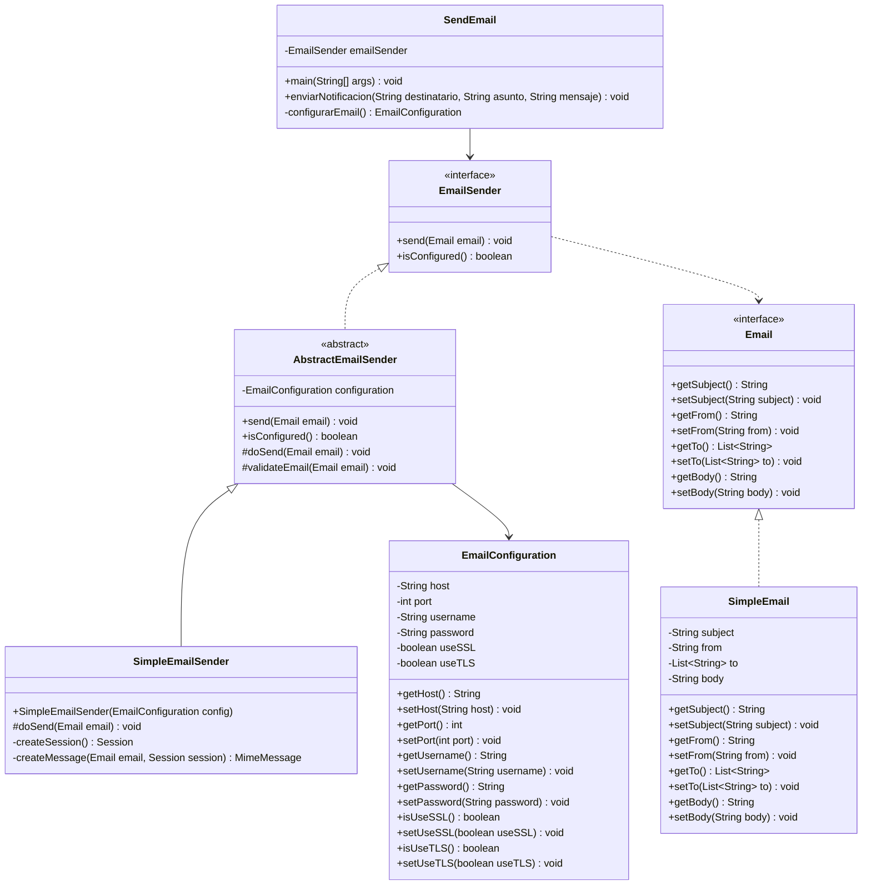
