# Diagramas de Arquitectura - SGAECI

## 1. Diagrama de Componentes Detallado del Sistema Legacy

```mermaid
graph TB
    subgraph "🎨 PRESENTATION LAYER - JSF Legacy"
        subgraph "Views (XHTML)"
            LOGIN[Registro.xhtml<br/>🔑 Login Interface]
            ADMIN_VIEWS[Admin Views<br/>📊 Dashboard & Management]
            USER_VIEWS[User Views<br/>👤 Student/Graduate Portals]
            PUBLIC_VIEWS[Public Views<br/>🌐 Registration Forms]
        end
        
        subgraph "Controllers (Managed Beans)"
            AUTH_CTRL[LogginBean<br/>🔐 Authentication]
            USER_CTRL[UsuarioBean<br/>👤 User Management]
            REQ_CTRL[SolicitudAfiliacionBean<br/>📝 Request Processing]
            ADMIN_CTRL[ProcesarSolicitudAfiliacionBean<br/>⚡ Admin Operations]
            PAY_CTRL[PagoAfiliacionBean<br/>💳 Payment Processing]
            RPT_CTRL[reporteVencerseBean<br/>📈 Reporting]
        end
        
        subgraph "UI Components"
            CSS[sheet.css<br/>🎨 Styling]
            RESOURCES[Static Resources<br/>🖼️ Images & Assets]
            PRIMEFACES[PrimeFaces Components<br/>📱 UI Widgets]
        end
    end
    
    subgraph "🏢 BUSINESS LAYER"
        SERVICES[ServiciosSAGECI<br/>📋 Business Logic]
        EXCEPTIONS[ExcepcionServiciosSAGECI<br/>⚠️ Error Handling]
    end
    
    subgraph "🗄️ DATA ACCESS LAYER"
        DAO_INTERFACES[DAO Interfaces<br/>📄 Data Contracts]
        MYBATIS_IMPL[MyBatis Implementations<br/>🔧 Data Operations]
        SQL_MAPPERS[XML Mappers<br/>📜 SQL Queries]
    end
    
    subgraph "📊 DOMAIN LAYER"
        ENTITIES[Domain Entities<br/>🏗️ Business Models]
    end
    
    subgraph "🔒 SECURITY MODULE - Apache Shiro"
        SHIRO_CONFIG[shiro.ini<br/>⚙️ Security Configuration]
        AUTH_REALM[JDBC Realm<br/>🗃️ Authentication Source]
        ENCRYPTION[SHA1.java<br/>🔐 Password Hashing]
    end
    
    subgraph "📧 COMMUNICATION MODULE"
        EMAIL_CORE[JavaMail Core<br/>📮 Email Engine]
        EMAIL_CONFIG[Email Configuration<br/>⚙️ SMTP Settings]
        MAILTRAP[Mailtrap Service<br/>📤 External Email Provider]
    end
    
    subgraph "💾 DATA PERSISTENCE"
        MYSQL_PROD[(MySQL Production<br/>🏭 Main Database)]
        H2_TEST[(H2 Testing<br/>🧪 Test Database)]
        MYBATIS_CONFIG[MyBatis Configuration<br/>⚙️ ORM Settings]
    end
    
    subgraph "📋 LOGGING & MONITORING"
        LOG4J[Log4J<br/>📝 Application Logging]
        REGISTRO[Registro.java<br/>🔍 Security Logging]
    end

    %% Connections
    LOGIN --> AUTH_CTRL
    ADMIN_VIEWS --> ADMIN_CTRL
    USER_VIEWS --> USER_CTRL
    PUBLIC_VIEWS --> REQ_CTRL
    
    AUTH_CTRL --> SERVICES
    USER_CTRL --> SERVICES
    REQ_CTRL --> SERVICES
    ADMIN_CTRL --> SERVICES
    PAY_CTRL --> SERVICES
    RPT_CTRL --> SERVICES
    
    SERVICES --> DAO_INTERFACES
    DAO_INTERFACES --> MYBATIS_IMPL
    MYBATIS_IMPL --> SQL_MAPPERS
    SQL_MAPPERS --> MYSQL_PROD
    SQL_MAPPERS --> H2_TEST
    
    SERVICES --> ENTITIES
    SERVICES --> EMAIL_CORE
    EMAIL_CORE --> MAILTRAP
    
    AUTH_CTRL --> SHIRO_CONFIG
    SHIRO_CONFIG --> AUTH_REALM
    AUTH_REALM --> ENCRYPTION
    
    SERVICES --> LOG4J
    SHIRO_CONFIG --> REGISTRO
    
    CSS --> PRIMEFACES
    PRIMEFACES --> USER_VIEWS
```

## 2. Componentes Priorizados para Modernización

### 🎯 **COMPONENTES CRÍTICOS A MODERNIZAR**

```mermaid
flowchart TD
    %% Alta Prioridad - Core del Negocio
    subgraph CRITICAL [" "]
        direction TB
        CRITICAL_TITLE["🔴 ALTA PRIORIDAD - Core del Negocio"]
        
        %% F001 - Autenticación
        AUTH_TITLE["F001 - Sistema de Autenticación"]
        AUTH_LEGACY["LogginBean + Shiro<br/>❌ JSF Managed Bean<br/>❌ SHA-1 Obsoleto<br/>❌ UI Legacy"]
        AUTH_MODERN["🔄 Modernizar a:<br/>✅ JWT/OAuth 2.0<br/>✅ React/Vue Components<br/>✅ Bcrypt/Argon2"]
        
        %% F002 - Formularios
        FORMS_TITLE["F002 - Formularios de Solicitud"]
        FORMS_LEGACY["SolicitudAfiliacionBean<br/>❌ Wizard JSF Complejo<br/>❌ Validaciones Limitadas<br/>❌ UX Desactualizada"]
        FORMS_MODERN["🔄 Modernizar a:<br/>✅ Multi-step Modern Forms<br/>✅ Real-time Validation<br/>✅ Responsive Design"]
        
        %% F003 - Dashboard
        ADMIN_TITLE["F003 - Dashboard Administrativo"]
        ADMIN_LEGACY["ProcesarSolicitudAfiliacionBean<br/>❌ Tablas JSF Básicas<br/>❌ Filtrado Limitado<br/>❌ UX Administrativa Pobre"]
        ADMIN_MODERN["🔄 Modernizar a:<br/>✅ Filtros Inteligentes<br/>✅ Dashboard Moderno"]
        
        %% F004 - Certificados
        CERT_TITLE["F004 - Generación de Certificados"]
        CERT_LEGACY["UsuarioBean + iText<br/>❌ PDF Básico<br/>❌ Diseño Desactualizado<br/>❌ Sin Personalización"]
        CERT_MODERN["🔄 Modernizar a:<br/>✅ Templates Modernos<br/>✅ Diseño Profesional<br/>✅ Múltiples Formatos"]
    end
    
    %% Media Prioridad
    subgraph MEDIUM [" "]
        direction TB
        MEDIUM_TITLE["🟡 MEDIA PRIORIDAD - Mejoras Operacionales"]
        
        %% F005 - Verificación Pagos
        PAY_TITLE["F005 - Verificación de Pagos"]
        PAY_LEGACY["ProcesarPagosAfiliacionBean<br/>❌ Visor Básico<br/>❌ Sin Herramientas"]
        PAY_MODERN["🔄 Mejorar:<br/>✅ Visor Avanzado<br/>✅ Herramientas de documentos"]
        
        %% F006 - Carga Comprobantes
        UPLOAD_TITLE["F006 - Carga de Comprobantes"]
        UPLOAD_LEGACY["GenerarPago Bean<br/>❌ Upload Básico<br/>❌ Sin Preview"]
        UPLOAD_MODERN["🔄 Mejorar:<br/>✅ Progreso de subida<br/>✅ Preview Integrado"]
    end
    
    %% Baja Prioridad
    subgraph KEEP [" "]
        direction TB
        KEEP_TITLE["🟢 BAJA PRIORIDAD - Mantener"]
        KEEP_COMPONENTS["📊 Reportes<br/>📧 Email System<br/>🗄️ Data Layer<br/>🔒 Security Core"]
    end
    
    %% Conexiones y layout
    CRITICAL_TITLE --- AUTH_TITLE
    AUTH_TITLE --- AUTH_LEGACY
    AUTH_LEGACY -.-> AUTH_MODERN
    
    AUTH_MODERN --- FORMS_TITLE
    FORMS_TITLE --- FORMS_LEGACY
    FORMS_LEGACY -.-> FORMS_MODERN
    
    FORMS_MODERN --- ADMIN_TITLE
    ADMIN_TITLE --- ADMIN_LEGACY
    ADMIN_LEGACY -.-> ADMIN_MODERN
    
    ADMIN_MODERN --- CERT_TITLE
    CERT_TITLE --- CERT_LEGACY
    CERT_LEGACY -.-> CERT_MODERN
    
    MEDIUM_TITLE --- PAY_TITLE
    PAY_TITLE --- PAY_LEGACY
    PAY_LEGACY -.-> PAY_MODERN
    
    PAY_MODERN --- UPLOAD_TITLE
    UPLOAD_TITLE --- UPLOAD_LEGACY
    UPLOAD_LEGACY -.-> UPLOAD_MODERN
    
    KEEP_TITLE --- KEEP_COMPONENTS
    
    %% Espaciado entre secciones
    CERT_MODERN ~~~ MEDIUM_TITLE
    UPLOAD_MODERN ~~~ KEEP_TITLE
    
    %% Estilos
    classDef criticalBox fill:#ffebee,stroke:#d32f2f,stroke-width:2px
    classDef mediumBox fill:#fff3e0,stroke:#f57c00,stroke-width:2px
    classDef keepBox fill:#e8f5e8,stroke:#388e3c,stroke-width:2px
    classDef legacy fill:#ffcdd2,stroke:#c62828,stroke-width:2px
    classDef modern fill:#c8e6c9,stroke:#2e7d32,stroke-width:2px
    classDef title fill:#e3f2fd,stroke:#1976d2,stroke-width:2px,font-weight:bold
    
    class CRITICAL_TITLE,MEDIUM_TITLE,KEEP_TITLE title
    class AUTH_TITLE,FORMS_TITLE,ADMIN_TITLE,CERT_TITLE,PAY_TITLE,UPLOAD_TITLE title
    class AUTH_LEGACY,FORMS_LEGACY,ADMIN_LEGACY,CERT_LEGACY,PAY_LEGACY,UPLOAD_LEGACY legacy
    class AUTH_MODERN,FORMS_MODERN,ADMIN_MODERN,CERT_MODERN,PAY_MODERN,UPLOAD_MODERN modern
    class KEEP_COMPONENTS keepBox
```

### 📋 **JUSTIFICACIÓN DE MODERNIZACIÓN POR COMPONENTE**

#### 🔴 **COMPONENTES CRÍTICOS (F001-F004)**

| **COMPONENTE** | **ESTADO ACTUAL** | **PROBLEMAS IDENTIFICADOS** | **JUSTIFICACIÓN DE MODERNIZACIÓN** |
|----------------|-------------------|------------------------------|-------------------------------------|
| **🔑 Sistema de Autenticación** | LogginBean + Apache Shiro + SHA-1 | - JSF Managed Bean obsoleto - SHA-1 deprecated (inseguro) - UX de login desactualizada - Sin recuperación de contraseña | **CRÍTICO:** Es la puerta de entrada al sistema. La seguridad obsoleta compromete toda la plataforma. La UX pobre impacta la primera impresión de AECI. |
| **📠Formularios de Solicitud** | SolicitudAfiliacionBean + Wizard JSF | - Wizard JSF complejo y confuso - Validaciones limitadas - UI no responsiva - Baja conversión de solicitudes | **CRÍTICO:** Proceso core para captar nuevos afiliados. La complejidad actual reduce conversiones y afecta el crecimiento de AECI. Primera impresión negativa de la asociación. |
| **📊 Dashboard Administrativo** | ProcesarSolicitudAfiliacionBean | - Tablas JSF básicas - Sin filtros avanzados - Gestión ineficiente - Tiempo excesivo por proceso | **CRÍTICO:** Los administradores son el cuello de botella. La ineficiencia actual impacta directamente los tiempos de respuesta a solicitantes y la operación diaria. |
| **📄 Generación de Certificados** | UsuarioBean + iText PDF | - Diseño desactualizado - PDF básico sin personalización - Imagen institucional pobre - Sin opciones de formato | **CRÍTICO:** Es el producto principal que AECI entrega. Un certificado desactualizado no refleja el profesionalismo de la institución y afecta la percepción de valor. |

#### 🟡 **COMPONENTES OPCIONALES (F005-F006)**

| **COMPONENTE** | **ESTADO ACTUAL** | **MEJORAS PROPUESTAS** | **JUSTIFICACIÓN** |
|----------------|-------------------|------------------------|-------------------|
| **💳 Verificación de Pagos** | ProcesarPagosAfiliacionBean | - Visor de imágenes mejorado - Herramientas de zoom/rotación - Procesamiento por lotes | **OPCIONAL:** Funcionalidad actual operativa. Mejoras incrementarían eficiencia administrativa pero no son críticas para el negocio. |
| **📤 Carga de Comprobantes** | GenerarPago Bean | - Drag & drop moderno - Preview antes de envío - Múltiples formatos - Validación automática | **OPCIONAL:** Solo afecta egresados. Funcionalidad actual suficiente. Mejoras serían de comodidad y UX, no críticas para operación. |

### 🎯 **CRITERIOS DE PRIORIZACIÓN BASADOS EN FEATURES.MD**

#### **Impacto en Core del Negocio:**
1. **F001 (Autenticación):** Base de seguridad - sin esto, nada funciona
2. **F002 (Solicitudes):** Crecimiento de membresía - captación de nuevos afiliados
3. **F003 (Aprobación):** Eficiencia operativa - cuello de botella administrativo
4. **F004 (Certificados):** Producto principal - imagen institucional

#### **Problemas Técnicos Críticos:**
- **JSF Legacy:** Tecnología obsoleta, difícil mantenimiento
- **Seguridad Desactualizada:** SHA-1 deprecated, vulnerabilidades
- **UX Pobre:** Interfaces no intuitivas, baja adopción
- **Performance:** Tecnologías lentas, no escalables

#### **ROI Esperado:**
- **Alto:** F001, F002, F003 (impacto directo en operación y crecimiento)
- **Medio:** F004 (imagen institucional, satisfacción)
- **Bajo:** F005, F006 (mejoras incrementales, no críticas)

### 🚀 **COMPONENTES A MANTENER (Sin Modernización)**

| **COMPONENTE** | **RAZÓN PARA MANTENER** |
|----------------|-------------------------|
| **📊 Sistema de Reportes** | Funcional, uso esporádico, ROI bajo para modernización |
| **📧 JavaMail System** | Operativo, estándar de la industria, sin problemas reportados |
| **🗄️ Data Access Layer** | MyBatis estable, consultas optimizadas, sin problemas de performance |
| **🔒 Apache Shiro Core** | Security framework robusto, solo modernizar la autenticación frontend |